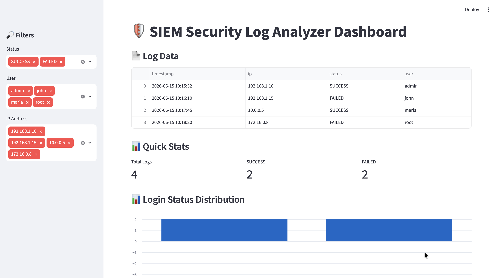
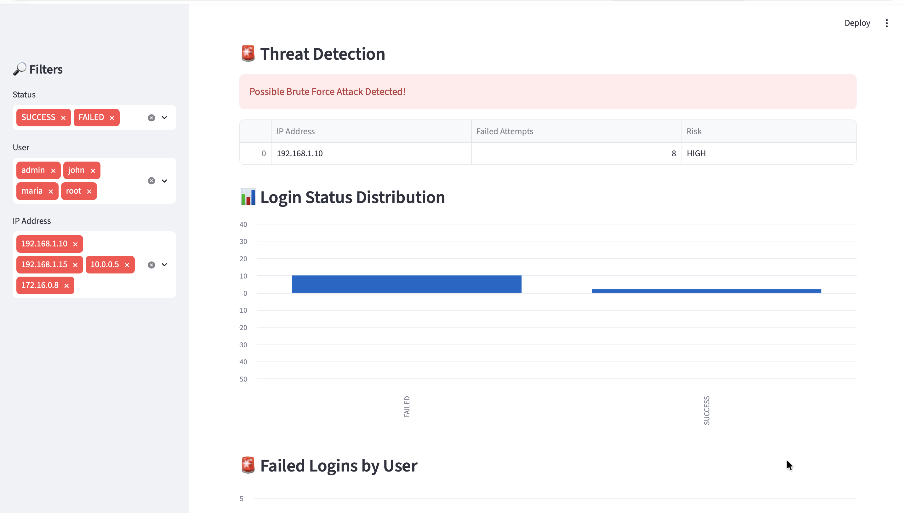

# SIEM-Security-Log-Analyzer
Python-based SIEM log analyzer for monitoring login events, failed authentications and suspicious activity.
# 🛡️ SIEM Security Log Analyzer Dashboard

Python-based SIEM log analyzer for monitoring login events, failed authentications, and suspicious activity.

## Dashboard Overview

## Threat Detection & Analytics

## Live Demo

https://siem-security-log-analyzer-5hr7v4bwwhp3brl9uapvjq.streamlit.app/

## Overview

This project is a beginner-level Security Information and Event Management (SIEM) dashboard built using Python, Streamlit, Pandas, and Regular Expressions (Regex).

The application reads server log files, extracts security-relevant information, and displays it through an interactive dashboard for security monitoring and analysis.

## Features

- Parse server logs using Regex
- Extract timestamps, IP addresses, usernames, and login status
- Interactive filtering by user, status, and IP address
- Login status distribution charts
- Failed login monitoring
- Security event visualization

## Technologies Used

- Python
- Streamlit
- Pandas
- Regular Expressions (Regex)
- Git & GitHub

## Learning Outcomes

Through this project, I learned:

- Log analysis fundamentals
-SIEM concepts
-Python file handling
-Data analysis with Pandas
-Dashboard development using Streamlit
-Git and GitHub workflow
-Basic threat detection techniques
-Brute-force attack identification

## Future Improvements

-Real-time log monitoring
-Email alerts
-Geo-IP mapping
-Machine learning anomaly detection
